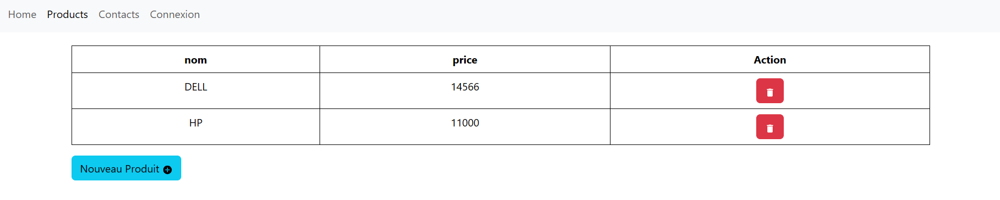
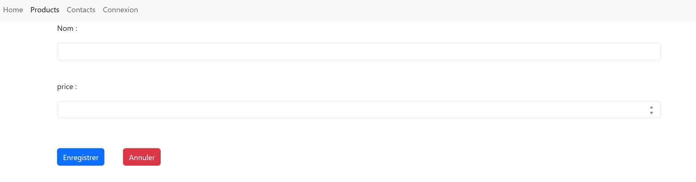
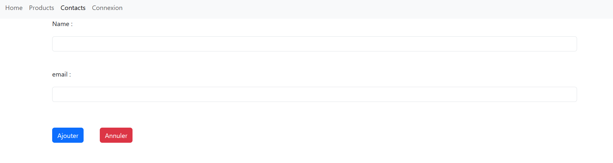
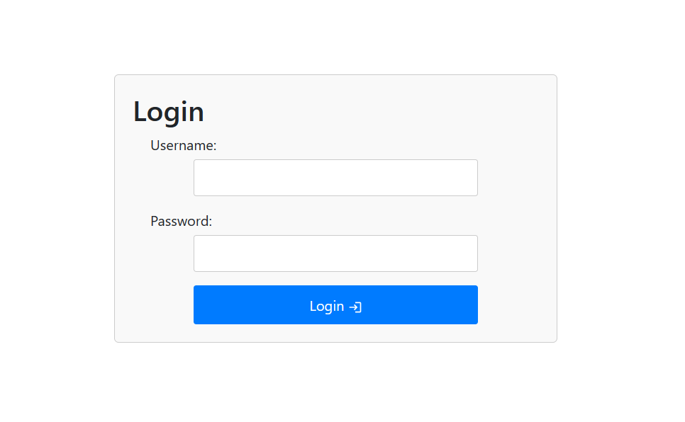
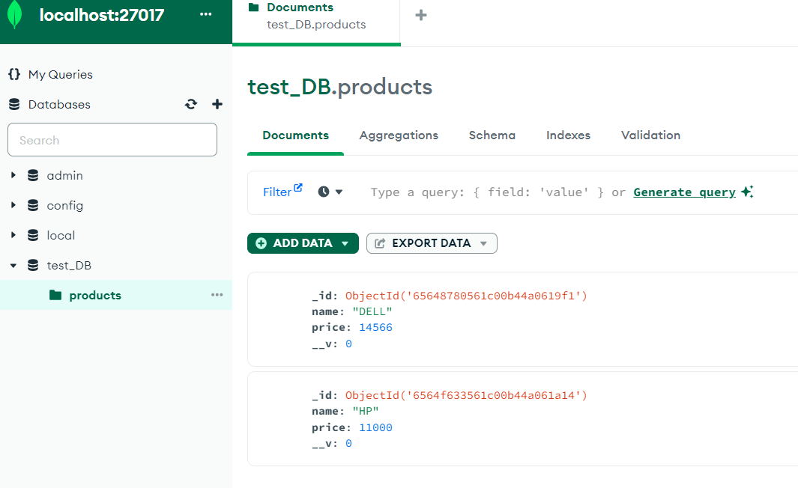

<h1>Compte rendu du contrôle</h1>

Ce contrôle a comme objectif de créer une application avec reactJs and nodeJs en utilisant MongoDB

<h2>Captures d'écran</h2>

Afficher la liste des produits

Ajouter un produit

Ajouter un contact

Log in

Base de donnée utilisée :

