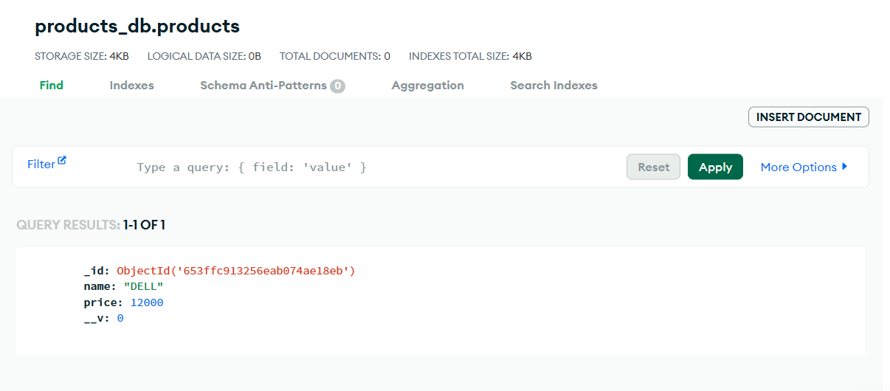

<h1>Créer une application NodeJs avec une DB Mongo Cloud</h1>

<h2>Pourquoi la structure du projet est importante?</h2>

Avoir un bon point de départ en ce qui concerne l'architecture de notre projet est crucial pour la longévité du projet lui-même et pour répondre efficacement aux besoins changeants futurs. Une architecture de projet mal conçue conduit souvent à :

<ul>
    <li>Code illisible et désorganisé, entraînant des processus de développement prolongés et rendant le produit lui-même plus difficile à tester</li>
    <li>Répétition inutile, rendant le code plus difficile à maintenir et à gérer</li>
    <li>Difficultés à implémenter de nouvelles fonctionnalités sans interférer avec le code existant</li>
</ul>

L’objectif principal de toute structure de projet Node.js est de vous accompagner dans :

<ul>
    <li>Écrire du code propre et lisible</li>
    <li>Création de composants et de modules de code réutilisables dans toute l'application</li>
    <li>Éviter les répétitions inutiles</li>
    <li>Intégrer de nouvelles fonctionnalités de manière transparente dans le code existant</li>
</ul>

<h2>Utiliser le modèle MVC</h2>

En ce qui concerne l'organisation du code, la mise en œuvre du modèle modèle-vue-contrôleur (MVC) largement adopté dans Node.js peut vous aider à séparer soigneusement les préoccupations de votre application en trois composants principaux : les modèles, les vues et les contrôleurs :

<ul>
    <li>
        
Le composant Modèle représente les données, les interactions de base de données et la logique métier de l'application. Il est responsable de la mise en œuvre des règles métier de base et de la logique des applications et se concentre également sur les opérations CRUD, la validation des données et le maintien de l'intégrité des données.

    </li>
    <li>
        
La principale responsabilité de la vue est de présenter les données à l'utilisateur et de gérer les composants de l'interface utilisateur. Il reçoit les données du modèle via des contrôleurs et les restitue pour que l'utilisateur puisse interagir.

    </li>
    <li>
        
le contrôleur sert de composant intermédiaire qui reçoit les entrées de l'utilisateur, met à jour les données du modèle selon les besoins et coordonne l'interaction entre le modèle et la vue. Le contrôleur met à jour le modèle en fonction des entrées de l'utilisateur et garantit que la vue affiche les données mises à jour.

    </li>
</ul>

<h2>Pourquoi MongoDB Atlas Cloud?</h2>

MongoDB Atlas est un service de base de données multi-cloud proposé par MongoDB qui simplifie le déploiement et la gestion des bases de données tout en offrant la flexibilité requise pour créer des applications globales résilientes et performantes sur les fournisseurs Cloud de votre choix. Atlas fournit toutes les fonctionnalités de MongoDB tout en automatisant les tâches d'administration de bases de données telles que la configuration de la base de données, le provisionnement de l'infrastructure, les correctifs, les événements de mise à l'échelle, les sauvegardes, etc., permettant aux développeurs de se concentrer sur ce qui compte le plus pour eux.

<h2>Principales fonctionnalités de MongoDB</h2>
<ul>
    <li>
        
<b>Efficacité opérationnelle :</b> MongoDB Atlas est livré avec les meilleures pratiques opérationnelles intégrées, qui permettent à l'utilisateur de se concentrer sur la création de valeur commerciale et l'accélération du développement d'applications plutôt que sur la gestion de bases de données.
        

    </li>
    <li>
        
<b>Clusters multi-cloud :</b> avec les clusters multi-cloud de MongoDB Atlas, vous pouvez profiter d'outils et de services uniques natifs des trois principaux fournisseurs de cloud (AWS, Google Cloud et Azure) sans ajouter de complexité inutile à votre expérience de gestion des données.
        

    </li>
    <li>
        
<b>Performances :</b> MongoDB Atlas fonctionne admirablement avec la plupart des applications. Puisqu'il peut être colocalisé avec n'importe quel fournisseur Cloud de votre choix, il n'y a pas de latence réseau supplémentaire et les boîtiers sont bien réglés pour garantir le bon fonctionnement de MongoDB.
        

    </li>
    

    
    

    
</ul>
